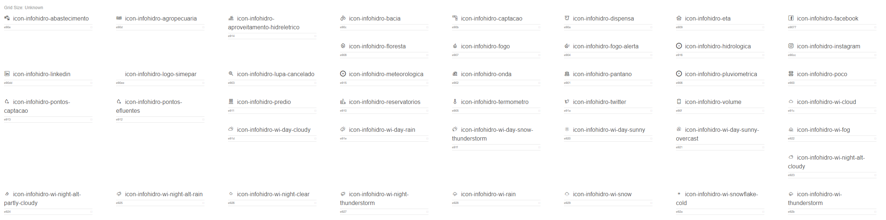

# Infohidro Sanepar Icon Fonts

(C) Copyright SIMEPAR - Sistema Meteorológico do Paraná

## What is it about?
Infohidro Sanepar Icon Fonts is a package that has icon fonts for Infohidro project with Sanepar - Companhia de Saneamento do Paraná.
## Get Started

### Installation
Import the icons from: 
```
<link rel="stylesheet" href="https://simepar.github.io/infohidro-icons/style.css">  
```

### HTML
Using the span tag you can add the icons:

```
<span class="icon-infohidro-<icon_class>"></span>
```

### Icon Classes


